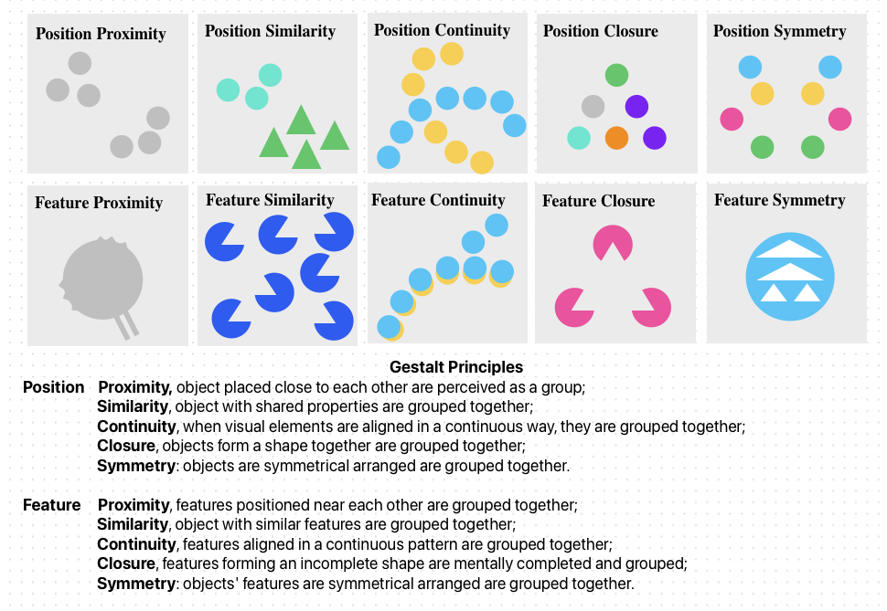

# Gestalt Pattern Reasoning Benchmark

## Overview
This repository contains a dataset and benchmarking framework for **Gestalt pattern reasoning**. The dataset consists of thousands of procedurally generated visual patterns based on **Gestalt principles**, including proximity, similarity, closure, symmetry, and continuity. The benchmark is designed to evaluate both human and AI performance in recognizing and reasoning about these patterns.

## File Structure
```
gestalt_benchmark/
│── data/
│   │── raw_patterns/         # Unprocessed/generated raw patterns
│   │   │── proximity/
│   │   │   │── train/
│   │   │   │   │── 0001_red_triangle/
│   │   │   │   │   │── positive/
│   │   │   │   │   │── negative/
│   │   │   │── test/
│   │   │   │   │── 0001_red_triangle/
│   │   │   │   │   │── positive/
│   │   │   │   │   │── negative/
│   │   │── similarity/
│   │   │   │── train/
│   │   │   │── test/
│   │   │── closure/
│   │   │   │── train/
│   │   │   │── test/
│   │   │── symmetry/
│   │   │   │── train/
│   │   │   │── test/
│   │   │── continuity/
│   │   │   │── train/
│   │   │   │── test/
│   │── processed_patterns/    # Processed & labeled patterns
│   │── metadata/              # Metadata and descriptions
│   │   │── pattern_metadata.json
│
│── scripts/
│   │── proximity/             # Folder containing scripts for proximity patterns
│   │   │── 0001_red_triangle.py
│   │   │── other_patterns.py
│   │── similarity/
│   │── closure/
│   │── symmetry/
│   │── continuity/
│   │── utils/                 # Folder containing utility functions
│   │   │── image_processing.py
│   │   │── dataset_helpers.py
│   │── main.py                # Entry point to generate all patterns of all principles
│   │── config.py              # Configuration settings for colors, shapes, and numbers
│   │── generate_patterns.py   # Script to generate patterns
│   │── process_patterns.py    # Cleaning, labeling, augmenting
│   │── evaluate_models.py     # Benchmarking models
│
│── benchmarks/
│   │── model_results/         # AI model performance results
│   │   │── model1.json
│
│── configs/
│   │── dataset_config.yaml    # Configuration file for pattern generation
│   │── model_config.yaml      # Model evaluation settings
│
│── notebooks/
│   │── pattern_analysis.ipynb # Jupyter notebooks for visualization
│   │── model_evaluation.ipynb
│
│── README.md
│── requirements.txt
```

## Installation
To use this benchmark, first clone the repository and install dependencies:
```bash
git clone https://github.com/your-repo/gestalt_benchmark.git
cd gestalt_benchmark
pip install -r requirements.txt
```

## Pattern Generation
To generate all patterns across all principles, run:
```bash
python scripts/main.py
```
To generate patterns based on a specific principle, run:
```bash
python scripts/generate_patterns.py --config configs/dataset_config.yaml
```
Generated patterns will be saved in `data/raw_patterns/`.

## Data Processing
To normalize, augment, and categorize patterns:
```bash
python scripts/process_patterns.py
```
Processed patterns will be stored in `data/processed_patterns/`.

## Benchmarking AI Models
To evaluate AI models on the dataset:
```bash
python scripts/evaluate_models.py --config configs/model_config.yaml
```
Results will be saved in `benchmarks/model_results/`.

## Gestalt Principles and Patterns
The benchmark includes five **Gestalt principles**:
- **Proximity**
- **Similarity**
- **Closure**
- **Symmetry**
- **Continuity**

For each principle, there are approximately **100 patterns**. Each pattern includes:
- **50 positive images** and **50 negative images** for training.
- **50 positive images** and **50 negative images** for testing.

Patterns are generated using basic objects such as:
- **Triangle**
- **Circle**
- **Square**

Each pattern has its own folder within the respective principle directory, containing **train** and **test** subdirectories, and each pattern is named in the format `id_pattern_name`.

## Metadata Format
Each pattern has an associated metadata entry in `data/metadata/pattern_metadata.json`:
```json
{
  "0001_red_triangle": {
    "type": "proximity",
    "difficulty": "easy",
    "resolution": "512x512",
    "generation_parameters": {
      "shape": "triangle",
      "spacing": "small",
      "alignment": "grid"
    }
  }
}
```
## Using Docker

To ensure compatibility across environments, you can use Docker to build and run the project.

### Building the Docker Image
``` 
docker build -t gestalt_benchmark .
```

### Running the Container

For CPU-only:
```
docker run --rm gestalt_benchmark -it
```

For GPU-accelerated training (if available):
```
 
docker run --gpus all --rm gestalt_benchmark -it
```

## Contribution
We welcome contributions to improve the dataset and evaluation framework. Please submit pull requests with explanations of changes.

## License
This project is licensed under the MIT License.

## Contact
For questions, reach out via [your contact email] or open an issue on GitHub.

---
🚀 **Ready to challenge AI with Gestalt patterns? Start now!**
